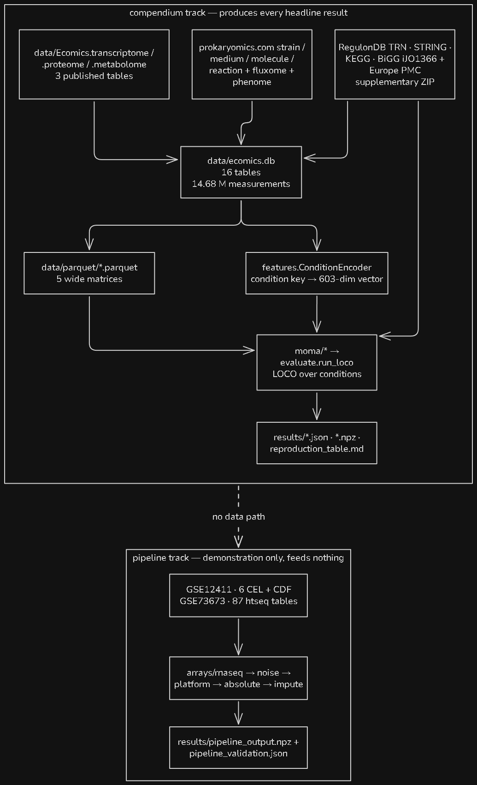

# Ecomics / MOMA — a from-scratch reproduction

## Headline results

All five MOMA layers — transcriptome, proteome, metabolome, fluxome, phenome - are implemented and evaluated here. Every figure below is leave-one-**condition**-out cross-validation.

| | Ours | Paper | |
|---|---|---|---|
| transcriptome, the paper's own protocol | **0.544 ± 0.165** | 0.54 ± 0.15 | 🟢 reproduces |
| proteome, neighbours vs own mRNA | **0.264 vs 0.086** (3.1×) | 0.55 vs 0.34 | 🟢 direction reproduces, level does not |
| proteome coverage, union of 6 networks | **588 / 589** | 1001 / 1001 | 🟢 no single network suffices |
| metabolome, core from protein | **0.420 ± 0.390** | 0.65 ± 0.21 | 🔴 outside one SD, and only 25 conditions |
| fluxome, FBA vs a held-out constant | **0.843** vs **0.896** | 0.72 | 🔴 the baseline wins, p = 5e-5 |
| phenome, consensus over 179 conditions | **0.602** | 0.65 ± 0.01 | 🟢 close; the paper CV'd over 101 |
| normalization pipeline vs Bioconductor | **PCC 0.999897** (RMA) | — | 🟢 independent agreement |

> ❗ **The fluxome row is the one to read twice.** `0.843` looks like it beats the paper's `0.72` until you ask what a *constant* scores on the same 22 reactions — which is `0.896`. FBA here captures the shape every flux profile shares and nothing that distinguishes one condition from another. 

> ❗ **Two numbers are called "PCC" and they are not the same measurement.** Per *molecule* across conditions, and per *profile* across molecules. They differ by roughly 0.3 on identical predictions. `03` prints the first (0.186); the paper reports the second, and on the paper's own protocol the same model with no code change scores **0.544**. Any comparison to the paper must go through `08`.

## Install

```bash
python -m venv .venv && source .venv/bin/activate   # .venv/Scripts/activate on Windows
pip install -r requirements.txt
```

**GPU is optional and only `03` uses it.** On Windows the default PyPI torch wheel is CPU-only, and `torch.cuda.is_available()` returns False even with a working driver. For CUDA there:

```bash
pip install torch --index-url https://download.pytorch.org/whl/cu130
```

Then check the **build tag**, not the version — it must read `+cu130`.

## Running it

|        | Command                                         | Writes                                               |
| ------ | ----------------------------------------------- | ---------------------------------------------------- |
| **00** | `python scripts/00_acquire.py`                  | `data/external/**`                                   |
| **01** | `python scripts/01_build_db.py`                 | `data/ecomics.db` + `data/parquet/*.parquet`         |
| **02** | `python scripts/02_run_pipeline.py`             | `results/pipeline_{output.npz,validation.json}`      |
| **03** | `python scripts/03_train_moma.py --device cuda` | `results/transcriptome_loco.json` + prediction cache |
| **04** | `python scripts/04_reproduce.py`                | `results/all_layers.json` + `results/reproduction_table.md` |
| **08** | `python scripts/08_methods_faithful_eval.py`    | `results/methods_faithful_eval.json`                 |
| **15** | `python scripts/15_figures.py`                  | `results/figures/*.png`                              |
| **17** | `python scripts/17_paper_networks_proteome.py`  | `results/paper_networks_proteome.json`               |

`00` and `01` are prerequisites for everything. After that, `02`, `03 → 08`, `04` and `17` are independent of one another. `08` refits nothing — it re-scores the out-of-fold predictions `03` cached, under the paper's protocol, so it costs seconds. `15` computes nothing at all: it reads the results of record and renders them, and is safe to re-run at any time.

**`04` is the five-layer driver.** It evaluates the proteome, metabolome, fluxome and phenome, reads the transcriptome result that `03` wrote, and assembles `results/reproduction_table.md`. It does **not** train the transcriptome - that is `03`. Pass `--all` to turn a missing transcriptome result from a warning into an error, so the table cannot silently ship without those rows.

```bash
python scripts/00_acquire.py --verify        # checksum every artefact, download nothing
python scripts/01_build_db.py --force        # required to rebuild; deletes the existing DB
python scripts/03_train_moma.py --folds 0    # true leave-one-condition-out, slow
python scripts/03_train_moma.py --depth-sweep 1,2,3,4 --out results/depth_sweep_loco.json
```

⚠ **Always pass `--out` with `--depth-sweep`.** It defaults to `results/transcriptome_loco.json`, and a sweep writes one block per depth - so a bare sweep replaces the single-depth result of record with a differently-shaped file.

---

One LASSO per target protein per graph, averaged over the graphs that cover each protein. The graphs are the paper's **own** edge lists from Supplementary Data 2 — six arms, `TRN · PPI · KEGG · SIGMA · SRNA` plus our held-out co-expression network.

⚠ **Read `SRNA` against its coverage.** Its `0.664` is the highest single-arm number anywhere in the layer, and it is computed over **5 of 589 proteins**. It means nothing. Coverage is in `results/all_layers.json` beside every arm, for exactly this reason.

⚠ **Supplementary Data 2 also ships the paper's co-expression network, and it must never enter an ensemble mean.** It was computed over the whole compendium, so it contains every LOCO test fold. The guard is the name: `ecomics/networks_paper.py:load_paper_networks` returns it only on request and only as `CPN_paper_LEAKY`, and anything ending in `_LEAKY` is excluded from the mean by `ecomics/moma/proteome_paper.py` while still being fitted and reported. A flag would not survive being copied into a table; the name does.

---

Model rigidity is chosen in **inverse** proportion to data availability — that is the organising principle of `ecomics/moma/`, and it is why the five layers look nothing like each other.

| Layer | Profiles | Model | Module |
|---|---:|---|---|
| transcriptome | 3,578 | relaxation RNN | `ecomics/moma/transcriptome.py` |
| proteome | 33 | network-neighbour LASSO ensemble | `ecomics/moma/proteome_paper.py` |
| metabolome | 25 / 6 | core from protein, non-core from transcript | `ecomics/moma/metabolome.py` |
| fluxome | 43 | FBA on iJO1366 — **needs no training data** | `ecomics/moma/fluxome.py` |
| phenome | 179 | performance-weighted consensus | `ecomics/moma/phenome.py` |

The fluxome is the odd one out in the evaluation too. FBA has no fit to hold out, so it never enters `ecomics/evaluate.py:run_loco`; its baselines come from `ecomics/evaluate.py:out_of_fold_baselines` instead, which holds out per condition the same way. 


# DATA-ATLAS

## 1 - The two tracks

The repo contains **two data tracks that never touch each other**.

- The **compendium track** takes the *already-normalized* published Ecomics tables plus a web scrape, builds a database, and trains MOMA on it. This is the track that produces every headline result.
- The **pipeline track** takes *raw* CEL and htseq files and re-implements the normalization procedure of the paper's Fig. 2 (but this implementation for now is not deeply tested/validated). Its output (`results/pipeline_output.npz`) is **never** read by `db/build.py` or by any model.



## 2 - Primary data sources

Three tables released by the Ecomics authors. They are the paper's output: measurements that have already been through the entire normalization pipeline of Fig. 2. Everything the models train on descends from these three files.

| Path                                  |       Bytes | Format | Shape                                          | Averaged?                       |
| ------------------------------------- | ----------: | ------ | ---------------------------------------------- | ------------------------------- |
| `Ecomics.transcriptome.no_avg.v8.txt` | 270,852,299 | TSV    | 3,578 rows × 4,098 cols (2 meta + 4,096 genes) | no — individual profiles        |
| `Ecomics.proteome.v5.csv`             |     115,705 | CSV    | 33 rows × 594 cols (5 meta + 589 proteins)     | **yes** — one row per condition |
| `Ecomics.metabolome.v3.csv`           |      34,812 | CSV    | 49 rows × 119 cols (5 meta + 114 metabolites)  | **yes** — one row per condition |

### Formats

```
# head -2 data/Ecomics.transcriptome.no_avg.v8.txt   (tab-delimited, columns elided)
ID	Cond	m.b4412	m.b1994	m.b2861	m.b4428	m.b0264	...
T0568	MG1655.MD026.RP-overexpress.na_WT	0.0855630708766258	0.130231463088323	...
```

```
# head -2 data/Ecomics.proteome.v5.csv   (columns elided)
Strain,MediumID,Medium,Stress,GP,m.b0002,m.b0003,m.b0004,m.b0008,...
N3433,MD004,MOPS+Glu(0.4%),none,none,1,0,1,0.451,0.318,...,0.971,0.041,NA,0,...
```

```
# head -2 data/Ecomics.metabolome.v3.csv   (columns elided)
Strain,MediumID,Medium,Stress,GP,m.X2HGTA,m.APAME,m.BA4A2H,m.C00009,...
MG1655,MD002,M9+Gly(40%),none,none,0.246,0.197,0.162,0.015,...
```

### Numbers

Values are on a **[0, 1] scale**, not raw copy numbers — the released compendium is min–max scaled, so a value of `0.451` means "45% of the way between this molecule's minimum and maximum across the compendium".

### ID conventions

- **Column ids** carry an `m.` prefix, stripped at load. Underneath: 
	- transcriptome and proteome use **b-numbers** (`b0002`); 
	- metabolome uses **KEGG compound ids for 101 of its 114 columns**, with 13 exceptions — `X2HGTA`, `APAME`, `BA4A2H`, `D08266`, `EMANTTE`, `HMDB02259`, `HMDB02356`, `HMDB06029`, `HMDB11739`, `INBG`, `IPTG`, `PY3H`, `TETRC`. 
	- of the proteome's 589 columns, 583 are strict `b\d{4}`.
- **Row ids**: transcriptome profiles are `T####`; the averaged tables have no profile id at all, because one row is one condition.
- **Condition** is written two incompatible ways *within these three files alone*: 
	- the transcriptome packs it into one dotted string `{STRAIN}.{MEDIUM_ID}.{STRESS}.{GP}`, 
	- the two CSVs spread it over five columns. 
	- the transcriptome writes wild type as **`na_WT`** while the fluxome writes **`WT_na`** - reversed. 


> [!WARNING] And the published proteome and metabolome are *condition-averaged*: the paper trained on 71 proteome and 696 metabolome profiles, which were never released.